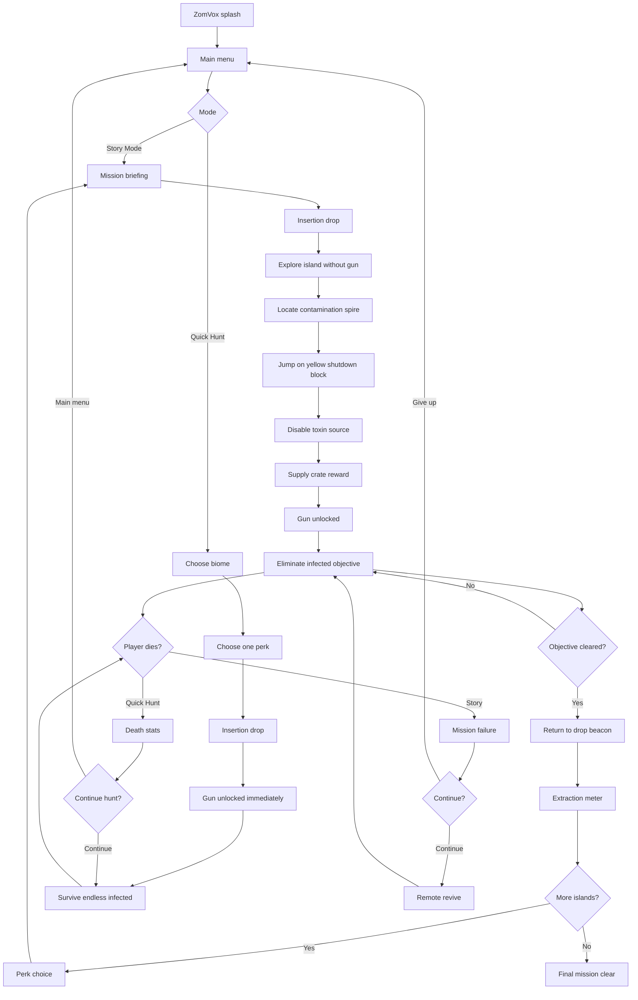

# ZomVox


**ZomVox: Zombies and Voxels** is a browser-based voxel zombie survival shooter built for quick static hosting. The player drops onto a fixed-size voxel island, hunts down a blinking metal contamination spire, jumps onto its yellow shutdown block under toxin pressure, then unlocks the blaster and fights roaming voxel zombies.

The game runs directly in the browser with WebGL. There is no build step, package install, bundler, backend, or asset pipeline required.

## Play

Open `index.html` in a modern browser with WebGL enabled.

Desktop play uses mouse and keyboard. Mobile play is designed for landscape orientation and uses touch controls. The mobile menu requests fullscreen when the Fullscreen setting is enabled and the player presses Play.

## Current Features

- Static browser game with split frontend files: `index.html`, `styles.css`, `config.js`, `sound.js`, and `script.js`.
- Branded ZomVox splash screen using `assets/zomvox-splash.png`.
- Splash screen build label using `BUILD_VERSION` plus the deployed document timestamp.
- Favicon assets for browser tabs and installed shortcuts.
- Procedural voxel terrain with mission biomes: forest, dunes, rocky, swamp, ashlands, and tundra.
- Sand and mud surfaces slow players and zombies by 15%.
- Fixed-size chunk generation so the game area stays bounded and performance remains predictable.
- Player movement is clamped inside the generated world.
- Targeted mesh rebuilding for mission set pieces and world updates.
- Mission-based opening loop with military-style objective briefings, cinematic insertion drops, a no-gun exploration phase, metal-spire shutdown objective, explosive supply crate reward, delayed zombie threat, drop-beacon extraction, upgrade choices, and escalating redeployment objectives across five seeded islands.
- Compact ammo HUD on desktop and mobile, plus a six-round blaster magazine with reserve ammo, recoil, and fire-rate cooldown.
- Ammo pickups that add six rounds at a time.
- Zombie spawning, ground-emerge entrances, pursuit steering around water/trees, attack cooldowns, retreat steps after attacks, deaths, score popups, and pickup drops.
- Weighted zombie variants: normal, speedy one-shot runners, and slower brute attackers.
- Mobile-only landscape gate.
- Mobile joystick movement plus separate jump and shoot controls.
- Main menu settings for health HUD, ammo HUD, controls, sound, and fullscreen.
- Day/night lighting with code-based mode options.
- Optional custom sky color through code.
- Optional fog through code.
- Dangerous water enabled by default through code.
- Damage flash and screen shake when the player is hit.
- Dramatic `YOU DIED!` overlay with respawn meter.
- Menu-safe gameplay pause so the player does not take damage before pressing Play.

## Game Flow



## Desktop Controls

- `WASD` or arrow keys: move
- Mouse: aim
- Jump onto the translucent yellow block: disable the contamination source
- Left click: shoot
- Right click or `R`: reload
- `Space`: jump
- `Shift`: sprint
- `N`: redeploy to the next mission island

## Mobile Controls

Mobile is intended for landscape play.

- Left joystick: move
- Swipe open play area: aim
- Shoot button: fire after the gun is awarded
- Jump button: jump

The mobile HUD is intentionally minimal. Health sits at the top left, ammo sits at the top right, and the old debug/status panel is removed so it does not block gameplay buttons.

## Settings Menu

The pre-game settings panel allows quick tuning before entering the world:

- Health: show or hide the health meter.
- Ammo: show or hide the ammo display.
- Controls: show or hide the mobile controls.
- Sound: turn game sounds on or off.
- Fullscreen: request fullscreen on mobile when play starts.

Seed controls were removed from the visible menu. The game rotates through configured mission island seeds, but players no longer have to manage seed values from the main screen.

## Code Options

Common tuning options live in `config.js` under `window.ZOMVOX_CONFIG`. Edit that file first for future balance, environment, or presentation changes.

```js
window.ZOMVOX_CONFIG = {
  buildVersion: '2026.07.06.11',
  initialSeed: 729641,

  environment: {
    timeMode: 'cycle',
    skyColor: null,
    dangerousWater: true,
    fog: true
  },

  timers: {
    cycleHalfDayMs: 360000
  },

  world: {
    chunkSize: 16,
    chunkRadius: 4,
    maxY: 38,
    waterLevel: 7,
    terrainBaseHeight: 4,
    terrainDetailAmount: 12,
    terrainBroadAmount: 10,
    terrainRidgeAmount: 2,
    terrainLakeADepth: 16,
    terrainLakeBDepth: 13,
    terrainMarshDepth: 16
  },

  player: {
    height: 1.76,
    radius: 0.31,
    stepHeight: 1.05,
    stepSmoothMs: 120
  },

  weapon: {
    magSize: 6,
    reloadTime: 1.15,
    fireCooldown: 0.42,
    recoilAmount: 0.08,
    quickReloadMultiplier: 0.5,
    doubleMagMultiplier: 2,
    premiumGripMultiplier: 0.38,
    hairTriggerMultiplier: 0.5,
    longRangeKillDistance: 34
  },

  mission: {
    islandSeeds: [29190, 482177, 735331, 918244, 126509],
    biomes: ['forest', 'dunes', 'rocky', 'swamp', 'ashlands'],
    toxinDamagePerSecond: 1.15,
    disableSeconds: 3,
    insertionDropHeight: 30,
    insertionFallSpeed: 5.8,
    infectedGoals: [25, 50, 100, 250, 500],
    infectedGoal: 50,
    firstWaveSize: 3
  }
};
```

`environment.timeMode` controls the lighting mode:

- `'cycle'`: normal day/night cycle.
- `'day'`: always daytime.
- `'night'`: always nighttime.

When cycling is enabled, `timers.cycleHalfDayMs` controls the pace in milliseconds. The default `360000` starts at dawn, reaches dusk 6 minutes later, then returns to dawn after another 6 minutes.

`environment.skyColor` controls the sky override:

- `null`: use the dynamic sky color from the active lighting mode.
- `'#102030'`: use a hex color string.
- `[0.06, 0.13, 0.20]`: use normalized RGB values from `0` to `1`.

`environment.dangerousWater` controls water/lava behavior:

- `true`: water renders as red lava, damages the player over time, and generates rocky shorelines. This is the default.
- `false`: water stays blue and is visual only.

Biome water notes:

- Dunes are dry and do not fill low terrain with water.
- Swamps render water as murky green-brown toxic water.
- Tundra freezes low basins into solid light-blue ice that players can slide across.

`environment.fog` controls distance fog:

- `true`: fog is enabled. This is the default.
- `false`: fog is disabled.

Other sections in `config.js` expose safe defaults for:

- `world`: chunk size, fixed map radius, max terrain height, water level, and terrain roughness/depression tuning.
- `player`: collision size, one-block terrain auto-step height, camera step smoothing, starting health, starting ammo reserve, respawn reserve floor, and low-health heartbeat threshold.
- `weapon`: magazine size, reload time, fire cooldown, recoil, upgrade multipliers, and long-range kill distance.
- `enemies`: base enemy cap and horde escalation values.
- `mission`: five island seeds, per-island biomes, toxin drain, source disable timing, insertion drop tuning, per-island infected objectives, fallback infected objective, and first wave size.
- `pickups`: ammo/health pickup amounts and drop chances.
- `timers`: death overlay delay, world rebuild meter duration, heartbeat interval, and day/night cycle length.
- `audio`: optional mp3/wav overrides for each sound effect.

Audio files live in `assets/`. Set a sound value to a file name to use that asset, `null` to keep the built-in synthesized effect, or `''` to disable that sound:

```js
audio: {
  files: {
    shoot: 'shoot.mp3',
    empty: null,
    reloadStart: null,
    pickupAmmo: 'pickup.mp3',
    pickupHealth: null,
    bite: null,
    toxin: null,
    land: '',
    objectiveClear: null
  }
}
```

## Repository Layout

```text
.
|-- README.md
|-- index.html
|-- config.js
|-- sound.js
|-- styles.css
|-- script.js
`-- assets/
    |-- favicon.ico
    |-- favicon.png
    |-- shoot.mp3
    |-- zomvox-gun-spritesheet.png
    `-- zomvox-splash.png
```

## File Responsibilities

- `index.html`: document structure, menu, settings, overlays, HUD containers, mobile controls, and script/style references.
- `config.js`: future-dev friendly tuning values for environment, world, player, weapon, enemies, pickups, timers, seed, and build version.
- `sound.js`: configurable audio playback with file overrides and synthesized fallback effects.
- `styles.css`: visual styling, responsive mobile layout, splash screen, health/ammo HUD, death overlay, world rebuild overlay, and touch controls.
- `script.js`: WebGL setup, procedural terrain, fixed world chunks, movement, combat, enemy behavior, pickups, world rebuilding, HUD updates, and game loop.
- `assets/`: splash screen, favicon files, weapon sprite sheet, and optional audio files.

## Hosting

Any static file host can serve the game. Upload the repository contents and open `index.html`.

For `zomvox.com`, point the domain at the static host or deployment target that serves these files. Because the project has no build step, the deployed files can be the same files in this repository.

## Project Status

ZomVox is in active prototype development. Current work is focused on mobile feel, smoother combat, readable HUD placement, terrain variety, fixed-size world performance, and keeping the browser game smooth on phones.
