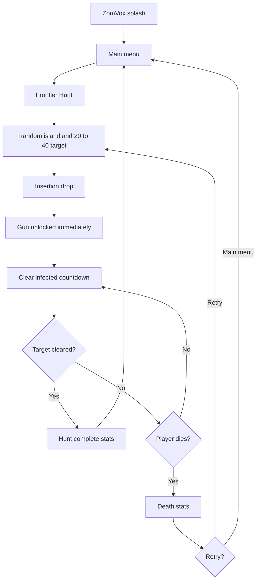

# ZomVox


**ZomVox: Zombies and Voxels** is a browser-based voxel zombie survival shooter built for quick static hosting. The player drops onto a randomized fixed-size voxel island, grabs ammo and C4, earns persistent session perks from kill streaks, and clears a short infected target before the island overwhelms them.

The game runs directly in the browser with WebGL. There is no build step, package install, bundler, backend, or asset pipeline required.

## Play

Open `index.html` in a modern browser with WebGL enabled.

Desktop play uses mouse and keyboard. Mobile play is designed for landscape orientation and uses touch controls. The mobile menu requests fullscreen when the Fullscreen setting is enabled and the player presses Play.

## Discovery

ZomVox is listed on [IGDB](https://www.igdb.com/) and [DEAD.ARMY](https://dead.army/). The canonical playable version remains [zomvox.com](https://zomvox.com/), so discovery pages and social posts should point players back to the official browser build.

## Current Features

- Static browser game with split frontend files: `index.html`, `styles.css`, `config.js`, `sound.js`, and `script.js`.
- Progressive Web App manifest, service worker, rotate-screen install choice, install/open-app hint, and landscape launch request for supported mobile browsers.
- Branded ZomVox splash screen using `assets/zomvox-splash.png`.
- Splash screen build label using `BUILD_VERSION` plus the deployed document timestamp.
- Favicon assets for browser tabs and installed shortcuts.
- Procedural voxel terrain with themed islands: forest, dunes, rocky, swamp, ashlands, and tundra.
- Procedural shader detail on grass block tops, thicker grassy side bands, and textured dirt faces.
- Visual-only ocean plane around each island so the world reads as an island without generating thousands of extra water blocks.
- Sand and mud surfaces slow players and zombies by 15%.
- Fixed-size chunk generation so the game area stays bounded and performance remains predictable.
- Player movement is clamped inside the generated world.
- Targeted mesh rebuilding for world updates, pickups, C4, and enemy effects.
- One-button Frontier Hunt loop with random biome selection and a random infected target from 20 to 40 kills.
- Center combat HUD with a voxel zombie head countdown for infected remaining.
- Compact ammo HUD on desktop and mobile, plus a six-round blaster magazine with magazine-swap reloads, reserve ammo, recoil, and fire-rate cooldown.
- Camo ammo pickups that add six rounds at a time, plus low-ammo mercy caches when reserve ammo hits zero.
- Flat silver C4 proximity charges with blinking red dots, yellow hazard strips, one starting charge, and rare zombie drops.
- Blue-accent perk crates awarded every five kills in one spawn; equipped perks persist for the current browser session and never repeat.
- Zombie spawning, ground-emerge entrances, pursuit steering around water/trees, attack cooldowns, retreat steps after attacks, deaths, score popups, and pickup drops.
- Weighted zombie variants: normal, speedy one-shot runners, slower brute attackers, and rare grey stalkers.
- Mobile-only landscape gate.
- Mobile joystick movement plus separate shoot and C4 controls.
- Main menu settings for ammo HUD, controls, sound, ambient audio, and fullscreen.
- Day/night lighting with code-based mode options.
- Optional custom sky color through code.
- Optional fog through code.
- Dangerous water enabled by default through code.
- Damage flash and screen shake when the player is hit.
- Two-bite wound/death loop with a red wounded vignette, ground-level death camera, blood particles, black fade, and `RESPAWNING...` countdown.
- Menu-safe gameplay pause so the player does not take damage before pressing Play.

## Game Flow


```mermaid
flowchart TD
    A[ZomVox splash] --> B[Main menu]
    B --> C[Frontier Hunt]
    C --> D[Random island and 20 to 40 target]
    D --> E[Insertion drop]
    E --> F[Gun unlocked immediately]
    F --> G[Clear infected countdown]
    G --> H{Target cleared?}
    H -->|Yes| I[Hunt complete stats]
    I --> B
    H -->|No| J{Player dies?}
    J -->|No| G
    J -->|Yes| K[Death stats]
    K --> L{Retry?}
    L -->|Retry| D
    L -->|Main menu| B
```

## Desktop Controls

- `WASD` or arrow keys: move
- Mouse: aim
- Left click: shoot
- Right click or `R`: reload
- `Space`: jump
- `C`: place C4 if equipped
- `Shift`: sprint
- `N`: roll a new hunt island

## Mobile Controls

Mobile is intended for landscape play.

- Left joystick: move
- Swipe open play area: aim
- Shoot button: fire after the gun is awarded
- C4 button: place a proximity charge if equipped

The mobile HUD is intentionally minimal. Health sits at the top left, ammo sits at the top right, and the old debug/status panel is removed so it does not block gameplay buttons.

## Settings Menu

The pre-game settings panel allows quick tuning before entering the world:

- Health: show or hide the health meter.
- Ammo: show or hide the ammo display.
- Controls: show or hide the mobile controls.
- Sound: turn game sounds on or off.
- Fullscreen: request fullscreen on mobile when play starts.

Seed controls were removed from the visible menu. Frontier Hunt rolls a fresh island seed with a runtime month/year prefix, so random islands naturally rotate each month without a new build.

## Code Options

Common tuning options live in `config.js` under `window.ZOMVOX_CONFIG`. Edit that file first for future balance, environment, or presentation changes.

```js
window.ZOMVOX_CONFIG = {
  buildVersion: '2026.08.01.15',
  initialSeed: 729641,

  environment: {
    timeMode: 'cycle',
    skyColor: null,
    dangerousWater: true,
    fog: true
  },

  timers: {
    cycleHalfDayMs: 360000
  },

  world: {
    chunkSize: 16,
    chunkRadius: 4,
    maxY: 38,
    waterLevel: 7,
    ocean: true,
    oceanPadding: 96,
    terrainBaseHeight: 4,
    terrainDetailAmount: 12,
    terrainBroadAmount: 10,
    terrainRidgeAmount: 2,
    terrainLakeADepth: 16,
    terrainLakeBDepth: 13,
    terrainMarshDepth: 16
  },

  player: {
    height: 1.76,
    radius: 0.31,
    stepHeight: 1.05,
    stepSmoothMs: 120
  },

  weapon: {
    magSize: 6,
    reloadTime: 1.15,
    fireCooldown: 0.42,
    recoilAmount: 0.08,
    quickReloadMultiplier: 0.5,
    doubleMagMultiplier: 2,
    premiumGripMultiplier: 0.38,
    hairTriggerMultiplier: 0.5,
    longRangeKillDistance: 34
  },

  mission: {
    insertionDropHeight: 30,
    insertionFallSpeed: 5.8,
    firstWaveSize: 3
  },

  comms: {
    dropIn: 'You are on {islandName}. The mission is to kill {zombieTotal} infected.',
    huntComplete: '{islandName} is clear. Good work, but there is more to do. Do you accept?',
    bitten: 'You are bit. Keep your distance and finish the objective.',
    death: 'Do you read me? Are you there?',
    fewMore: 'Just a few more.',
    lowHealth: 'Retreat and treat your wounds.',
    longRange: 'Nice shot.',
    ammoCache: 'Ammo cache marked nearby.'
  }
};
```

`environment.timeMode` controls the lighting mode:

- `'cycle'`: normal day/night cycle.
- `'day'`: always daytime.
- `'night'`: always nighttime.

When cycling is enabled, `timers.cycleHalfDayMs` controls the pace in milliseconds. The default `360000` starts at dawn, reaches dusk 6 minutes later, then returns to dawn after another 6 minutes.

`environment.skyColor` controls the sky override:

- `null`: use the dynamic sky color from the active lighting mode.
- `'#102030'`: use a hex color string.
- `[0.06, 0.13, 0.20]`: use normalized RGB values from `0` to `1`.

`environment.dangerousWater` controls water/lava behavior:

- `true`: water renders as red lava, damages the player over time, and generates rocky shorelines. This is the default.
- `false`: water stays blue and is visual only.

Biome water notes:

- Dunes are dry and do not fill low terrain with water.
- Swamps render water as murky green-brown toxic water.
- Tundra freezes low basins into solid light-blue ice that players can slide across.

`environment.fog` controls distance fog:

- `true`: fog is enabled. This is the default.
- `false`: fog is disabled.

Other sections in `config.js` expose safe defaults for:

- `world`: chunk size, fixed map radius, max terrain height, water level, and terrain roughness/depression tuning.
- `player`: collision size, one-block terrain auto-step height, camera step smoothing, starting health, starting ammo reserve, starting C4, respawn reserve floor, and low-health heartbeat threshold.
- `weapon`: magazine size, magazine-swap reload time, fire cooldown, recoil, perk multipliers, and long-range kill distance.
- `enemies`: base enemy cap, horde escalation values, and close-range zombie moan radius/voice/timing controls.
- `mission`: Frontier Hunt insertion drop timing and first wave size. The active hunt loop rolls random biome seeds and infected targets at runtime.
- `comms`: short Mission Command radio lines for drop-in, hunt-complete, bite, death, objective, long-range, and ammo-cache events. `dropIn` supports `{islandName}`, `{biome}`, and `{zombieTotal}` placeholders; `huntComplete` supports `{islandName}` and `{biome}`.
- `pickups`: ammo and C4 pickup amounts/drop chances. Health pickups are intentionally disabled.
- `timers`: auto-respawn countdown, world rebuild meter duration, heartbeat interval, and day/night cycle length.
- `audio.files`: optional file-backed sounds for weapon, impact, pickup, UI, zombie, and ambient cues. File cues are tried first when configured; blank cues fall back to procedural audio.
- `audio.playbackRates`: optional per-cue file playback speed multipliers, such as `shoot: 1.15` to make a stock asset feel snappier.

Audio is handled through `sound.js`, which loads the no-build classic scripts in `audio/`. The engine uses file-backed playback first for configured cue files in `assets/`, with procedural Web Audio synthesis kept as the fallback when a slot is blank or a file is unavailable. Procedural fallback cues use short ADSR-style envelopes, layered filtered noise, detuned shimmer tones for pickups, oscillators, soft-limited buses, and biome ambience beds.

Procedural cue references:

- Weapon: `shoot`, `empty`, `reloadStart`, `reloadDone`, `explosion`.
- Impact and feedback: `hit`, `head`, `kill`, `block`, `hurt`, `death`, `toxin`, `heartbeat`.
- Pickups and UI: `pickupAmmo`, `pickupC4`, `pickup`, `perkEquip`, `confirm`, `briefing`, `objectiveClear`, `wave`.
- Foley and ambience: `footstep`, `land`, `ambientMenu`, `ambientForest`, `ambientDunes`, `ambientRocky`, `ambientSwamp`, `ambientAshlands`, `ambientTundra`. Footsteps use lightweight heel/toe contacts, surface scuff, grit, splash, and ice/wood accents. Ambience includes procedural beds plus occasional biome/menu sweeteners, mixed below zombie voices so nearby threats stay readable.
- Zombie voices: `zombieMoan` can use `assets/zombieMoan.mp3` with per-type playback speed/reverse behavior when configured in `config.js`; otherwise the procedural fallback is used.

Mission command lines are visual radio comms toasts in the HUD instead of browser text-to-speech, so they stay readable and consistent across devices.

## Repository Layout

```text
.
|-- README.md
|-- index.html
|-- config.js
|-- manifest.webmanifest
|-- sw.js
|-- sound.js
|-- audio/
|   |-- audio-config.js
|   |-- dsp.js
|   |-- weapons.js
|   |-- foley.js
|   |-- voice.js
|   |-- mixer-runtime.js
|   |-- ambience.js
|   `-- index.js
|-- styles.css
|-- script.js
`-- assets/
    |-- favicon.ico
    |-- favicon.png
    |-- favicon-192.png
    |-- zomvox-gun-spritesheet.png
    `-- zomvox-splash.png
```

## File Responsibilities

- `index.html`: document structure, menu, settings, overlays, HUD containers, mobile controls, and script/style references.
- `config.js`: future-dev friendly tuning values for environment, world, player, weapon, enemies, pickups, timers, seed, and build version.
- `manifest.webmanifest`: install metadata, app icons, fullscreen display, and landscape orientation request.
- `sw.js`: lightweight service worker for app shell caching and home-screen launch reliability.
- `sound.js`: tiny compatibility loader that keeps the old script entry point while loading the split audio engine in order.
- `audio/`: pure procedural Web Audio effects split by responsibility: config/RNG, DSP helpers, weapons, foley/UI, formant voices, mixer/runtime routing, ambience, and cue dispatch.
- `styles.css`: visual styling, responsive mobile layout, splash screen, health/ammo HUD, death overlay, world rebuild overlay, and touch controls.
- `script.js`: WebGL setup, procedural terrain, fixed world chunks, movement, combat, enemy behavior, pickups, world rebuilding, HUD updates, and game loop.
- `assets/`: splash screen, favicon files, title/social images, weapon sprite sheet, and optional cue audio files such as `zombieMoan.mp3`.

## Hosting

Any static file host can serve the game. Upload the repository contents and open `index.html`.

For `zomvox.com`, point the domain at the static host or deployment target that serves these files. Because the project has no build step, the deployed files can be the same files in this repository.

## Project Status

ZomVox is in active prototype development. Current work is focused on mobile feel, smoother combat, readable HUD placement, terrain variety, fixed-size world performance, and keeping the browser game smooth on phones.
